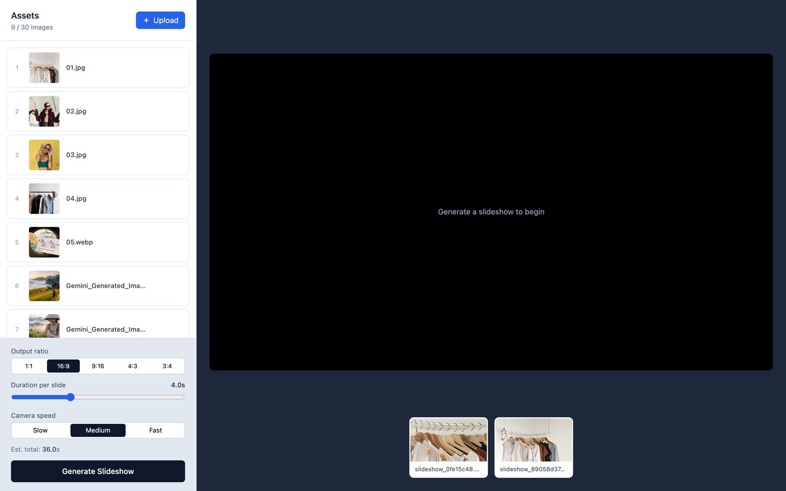
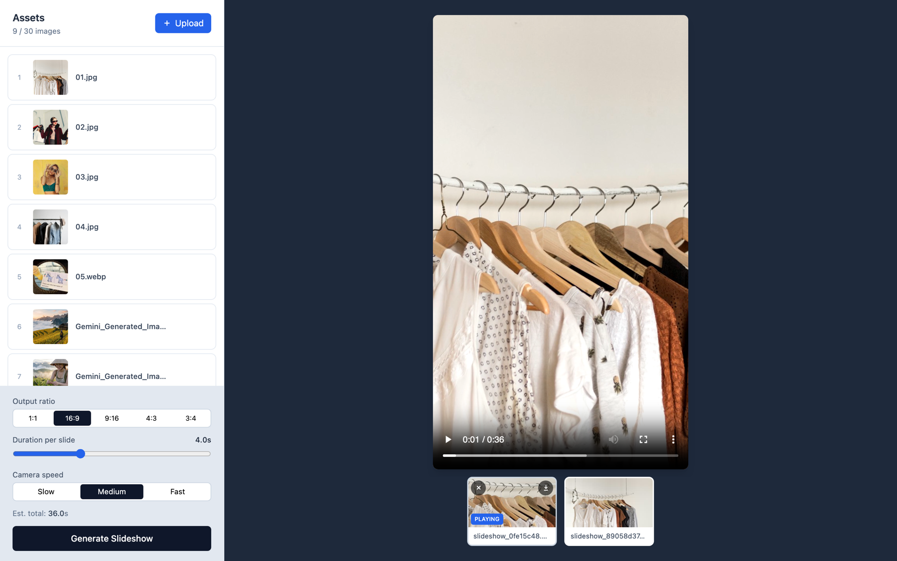
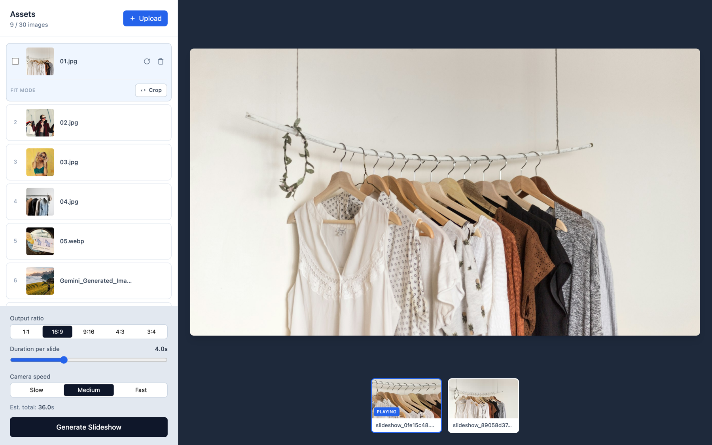

# Slideshow Studio

A small web app that turns a folder of images into a 1080p Ken Burns slideshow MP4. FastAPI on the backend, a single vanilla-JS page on the frontend, `ffmpeg` doing the heavy lifting — no build step, no JavaScript framework, no database.

Built for fashion / product image rolls where you want clean motion, predictable framing, and a one-click render.

---

## Screenshots







---

## Features

**Asset manager**
- Drop in up to 30 images (`.jpg`, `.jpeg`, `.png`, `.webp`)
- Hover a card to replace or delete it
- Drag-to-reorder with a smooth FLIP animation
- Click any thumbnail to preview the full image

**Output controls**
- Output ratio: `1:1`, `16:9`, `9:16`, `4:3`, `3:4`
- Duration per slide: 1–10s slider
- Camera speed: Slow / Medium / Fast (controls Ken Burns zoom amount)
- Fit mode: **Crop** (cover, may cut the subject) or **Letterbox** (contain, preserves the image with a soft blurred backdrop)

**Renderer**
- Random Ken Burns direction per slide — pan ↔, pan ↕, zoom in, zoom out
- Adaptive pre-upscale to ≥ 6000 px on the shorter edge — defeats the `zoompan` filter's per-frame quantization (the source of the classic "shaky" look on small images)
- Direction pool biases toward the image's long axis when letterboxing, so pans don't cross the blurred bands

**Output gallery**
- Thumbnails for every render under the player, newest on the right
- Click to play, double-click the filename to rename inline, hover for delete (×) / download (↓)
- Currently-playing thumbnail is highlighted, and the preview resizes to match each video's native aspect when you switch

---

## Stack

| | |
|---|---|
| Backend | Python 3.10+, [FastAPI](https://fastapi.tiangolo.com/), [Uvicorn](https://www.uvicorn.org/), [Pillow](https://python-pillow.org/) |
| Video | [`ffmpeg`](https://ffmpeg.org/) + `ffprobe` (system binaries) |
| Frontend | Vanilla JS, [Tailwind](https://tailwindcss.com/) CDN, [SortableJS](https://sortablejs.github.io/Sortable/) CDN |

---

## Quick start

System dependency:

```bash
# macOS
brew install ffmpeg
# Debian/Ubuntu
sudo apt install ffmpeg
```

Then:

```bash
git clone https://github.com/nsongha/slideshow-studio.git
cd slideshow-studio

python3 -m venv .venv
source .venv/bin/activate
pip install -r requirements.txt

uvicorn app:app --port 8765
```

Open <http://localhost:8765> and start uploading.

Four sample fashion photos from Unsplash live in `images/` so the app has something to show on first run.

---

## How it works

```
images/                   ← uploaded assets
  01.jpg
  …

output/                   ← rendered slideshows
  slideshow_<hash>.mp4
  thumbs/                 ← lazy-generated JPGs for the gallery

app.py                    ← FastAPI: REST + static serving
slideshow.py              ← ffmpeg pipeline (zoompan, blur composite, concat)
static/index.html         ← single-page UI
```

**Per slide**, `render_clip` decides between two paths:

```
crop:        [optional crop to output ratio] → scale ≥ 6000 px → zoompan → encode
letterbox:   blur-composite into out_w × out_h → scale 3× → zoompan → encode
```

`build_slideshow` then concats the clips with `-c copy` so there's no second re-encode.

The "shake-free" trick is to scale the source way bigger than the output before running `zoompan`. With a slow camera (`zoom = 1.06` over 4s = `0.0005` zoom delta per frame), `ffmpeg`'s integer pixel rounding quantizes the motion at typical resolutions. Pre-scaling so the source's short edge is ≥ 6000 px pushes that quantization well below one displayed pixel.

---

## REST API

| Method | Path | Purpose |
|---|---|---|
| `GET` | `/api/images` | List assets (returns `{images, max}`) |
| `GET` | `/api/images/{name}` | Fetch an image |
| `POST` | `/api/images` | Upload (`multipart/form-data`) |
| `PUT` | `/api/images/{name}` | Replace |
| `DELETE` | `/api/images/{name}` | Delete |
| `POST` | `/api/generate` | Render a slideshow |
| `GET` | `/api/outputs` | List rendered videos (oldest → newest) |
| `GET` | `/api/output/{name}` | Stream the MP4 |
| `GET` | `/api/output/{name}/thumb` | Get / lazy-generate a 320 px thumbnail |
| `PUT` | `/api/output/{name}` | Rename (body: `{"new_name": "..."}`) |
| `DELETE` | `/api/output/{name}` | Delete video + thumb |

`POST /api/generate` body:

```json
{
  "filenames":  ["01.jpg", "02.jpg"],
  "duration":   4.0,
  "speed":      "medium",
  "ratio":      "16:9",
  "fit_mode":   "crop"
}
```

---

## Project layout

```
.
├── app.py                  ~140 lines, REST + static serving
├── slideshow.py            ~190 lines, ffmpeg pipeline
├── static/
│   └── index.html          single-page UI
├── images/                 demo assets (Unsplash)
├── output/                 generated MP4s (gitignored)
├── requirements.txt
└── .gitignore
```

---

## Author

**SongHa** — <https://github.com/nsongha>

## License

[MIT](LICENSE)
